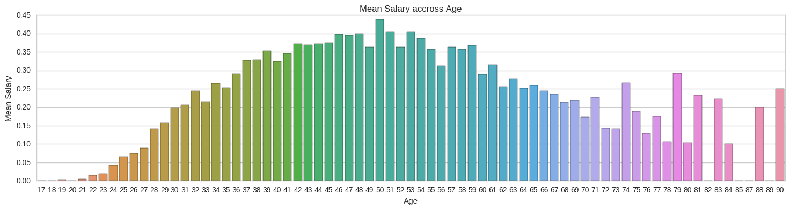
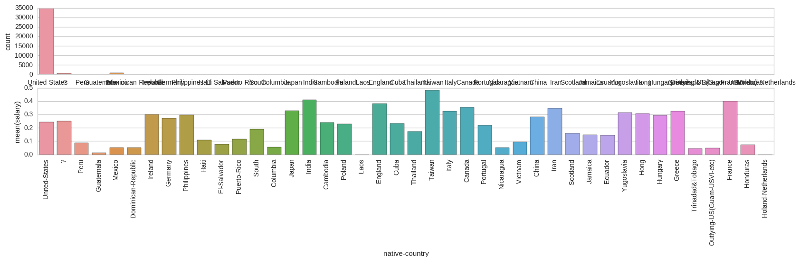

# Analysis on the Census Income Dataset
[Please Click here to read web friendly version](https://har33sh.github.io/ArtificialNeuralNetwork/)

<br /><br />
*Task is to predict whether income exceeds 50K/yr based on census data. Also known as "Census Income" dataset*<br />

**Note that in the train and test data,salary > 50K is represented by 1 and <= 50K is represented by 0** <br />

**Data set description**: Below is a brief overview of type and values for various features in the data set.
<br /><br />
**age**: continuous.<br />
**workclass**: Private, Self-emp-not-inc, Self-emp-inc, Federal-gov, Local-gov, State-gov, Without-pay, Never-worked.<br />
**fnlwgt**: continuous.<br />
**education**: Bachelors, Some-college, 11th, HS-grad, Prof-school, Assoc-acdm, Assoc-voc, 9th, 7th-8th, 12th, Masters, 1st-4th, 10th, Doctorate, 5th-6th, Preschool.<br />
**education-num**: continuous.<br />
**marital-status**: Married-civ-spouse, Divorced, Never-married, Separated, Widowed, Married-spouse-absent, Married-AF-spouse.<br />
**occupation**: Tech-support, Craft-repair, Other-service, Sales, Exec-managerial, Prof-specialty, Handlers-cleaners, Machine-op-inspct, Adm-clerical, Farming-fishing, Transport-moving, Priv-house-serv, Protective-serv, Armed-Forces.<br />
**relationship**: Wife, Own-child, Husband, Not-in-family, Other-relative, Unmarried.<br />
**race**: White, Asian-Pac-Islander, Amer-Indian-Eskimo, Other, Black.<br />
**sex**: Female, Male.<br />
**capital-gain**: continuous.<br />
**capital-loss**: continuous.<br />
**hours-per-week**: continuous.<br />
**native-country**: United-States, Cambodia, England, Puerto-Rico, Canada, Germany, Outlying-US(Guam-USVI-etc), India, Japan, Greece, South, China, Cuba, Iran, Honduras, Philippines, Italy, Poland, Jamaica, Vietnam, Mexico, Portugal, Ireland, France, Dominican-Republic, Laos, Ecuador, Taiwan, Haiti, Columbia, Hungary, Guatemala, Nicaragua, Scotland, Thailand, Yugoslavia, El-Salvador, Trinadad&Tobago, Peru, Hong, Holand-Netherlands.
<br /><br /><br />

### Importing libraries and reading the census data


```python
import pandas as pd
from pandas import Series,DataFrame
import numpy as np
import matplotlib.pyplot as plt
import seaborn as sns
sns.set_style('whitegrid')
%matplotlib inline
# Reading the census data into dataframes
train_df = pd.read_csv("data/train.csv")
#getting to know about the data
# train_df.info()  
```


### Visualization on Age column


```python
plt.figure(figsize=(18,4))
sns.countplot(x='age', data=train_df)
sns.plt.title('Distribution of Dataset on Age')

# peaks for salary true or false  by their age
facet = sns.FacetGrid(train_df, hue="salary",aspect=4)
facet.map(sns.kdeplot,'age',shade= True)
facet.set(xlabel='Age', ylabel='',xlim=(0, train_df['age'].max()))
facet.add_legend()
sns.plt.title('Peaks for Salary')

# average salary passengers by age
fig, axis1 = plt.subplots(1,1,figsize=(18,4))
average_age = train_df[["age", "salary"]].groupby(['age'],as_index=False).mean()
ax=sns.barplot(x='age', y='salary', data=average_age)
ax.set(xlabel='Age', ylabel='Mean Salary')
sns.plt.title('Mean Salary accross Age')
```

    /home/hareesh/anaconda3/lib/python3.5/site-packages/statsmodels/nonparametric/kdetools.py:20: VisibleDeprecationWarning: using a non-integer number instead of an integer will result in an error in the future
      y = X[:m/2+1] + np.r_[0,X[m/2+1:],0]*1j


    <matplotlib.text.Text at 0x7f0ab53b44e0>





#### Observation

**Dataset**: The data is collected between the age group 17-90, and most of the data is from age 19-47. <br />
**Peak**: Most of the people of the age 22$\pm$2 get salary < 50k and most of the people of the age 42$\pm$5 get salary >=50k <br />
The last figure shows the average salary of people <br/> <br/> 


### Visualization on Workclass column


```python
# Plotting the distribution of dataset on workclass
fig, (axis1,axis2) = plt.subplots(2,figsize=(20,10))
sns.countplot(x='workclass', data=train_df, ax=axis1)
sns.plt.title('Distribution of Dataset on workclass')

# average salary for each Person based on workclass
person_perc = train_df[["workclass", "salary"]].groupby(['workclass'],as_index=False).mean()
sns.barplot(x='workclass', y='salary', data=person_perc, ax=axis2,order=list(train_df.workclass.unique()))
sns.plt.title('Mean Salary accross workclass')
```


    <matplotlib.text.Text at 0x7f0ab53f2e80>


#### Observation

**Dataset**: The data is collected between the age group 17-90, and most of the data is from age 19-47. <br />
**Peak**: Most of the people of the age 22$\pm$2 get salary < 50k and most of the people of the age 42$\pm$5 get salary >=50k <br />
The last figure shows the average salary of people <br/> <br/> 


### Visualization on fnlwgt column


```python
# peaks for fnlwgt true or false by their age
facet = sns.FacetGrid(train_df, hue="salary",aspect=4)
facet.map(sns.kdeplot,'fnlwgt',shade= True)
facet.set(xlim=(0, train_df['fnlwgt'].max()))
facet.add_legend()
```

    /home/hareesh/anaconda3/lib/python3.5/site-packages/statsmodels/nonparametric/kdetools.py:20: VisibleDeprecationWarning: using a non-integer number instead of an integer will result in an error in the future
      y = X[:m/2+1] + np.r_[0,X[m/2+1:],0]*1j


    <seaborn.axisgrid.FacetGrid at 0x7f0ab8504cc0>


#### Observation

*Peak for the salary < 50 is almost same as the peak >= 50 for the same inputs* <br /> ** This can be removed as there is high correlation between them** <br/> <br />

### Visualization on education column


```python
# Plotting the distribution of dataset on education
fig, (axis1,axis2) = plt.subplots(2,figsize=(20,10))
sns.countplot(x='education', data=train_df, ax=axis1)
sns.plt.title('Distribution of Dataset on education')

# average salary for each Person based on education
person_perc = train_df[["education", "salary"]].groupby(['education'],as_index=False).mean()
sns.barplot(x='education', y='salary', data=person_perc, ax=axis2,order=list(train_df.education.unique()))
sns.plt.title('Mean Salary accross education')
```


    <matplotlib.text.Text at 0x7f0ab5230208>


#### Observation
**Dataset**: Most of the dataset is of High School grads, Bachelors and College people
*Masters, Doctorate and Professors in School have high probablity of getting salary > 50k*


### Visualization on education-num column


```python
# Plotting the distribution of dataset on education-num
fig, (axis1,axis2) = plt.subplots(2,figsize=(20,10))
order_list=list(range(1,17))
sns.countplot(x='education-num', data=train_df, ax=axis1,order=order_list)
sns.plt.title('Distribution of Dataset on education-num')

# average salary for each Person based on education-num
person_perc = train_df[["education-num", "salary"]].groupby(['education-num'],as_index=False).mean()
sns.barplot(x='education-num', y='salary', data=person_perc, ax=axis2,order=order_list)
```


    <matplotlib.axes._subplots.AxesSubplot at 0x7f0ab857c4e0>


#### Observation
**Dataset**: Most of the people have 9-10 years of education <br />
*People higher number of education are likely to have salary > 50k*
<br /> <br />


### Visualization on marital-status column


```python
# Plotting the distribution of dataset on  marital-status
fig, (axis1,axis2) = plt.subplots(2,figsize=(20,10))
sns.countplot(x='marital-status', data=train_df, ax=axis1)
sns.plt.title('Distribution of Dataset on marital-status')

# average salary for each Person based on marital-status
person_perc = train_df[["marital-status", "salary"]].groupby(['marital-status'],as_index=False).mean()
sns.barplot(x='marital-status', y='salary', data=person_perc, ax=axis2,order=list(train_df["marital-status"].unique()))
sns.plt.title('Mean Salary accross marital-status')
```


    <matplotlib.text.Text at 0x7f0ab5c64828>


#### Observation

*Married people with spouse have high probablity of getting salary > 50k*


### Visualization on occupation column


```python
# Plotting the distribution of dataset on occupation
fig, (axis1,axis2) = plt.subplots(2,figsize=(25,10))
sns.countplot(x='occupation', data=train_df, ax=axis1)
sns.plt.title('Distribution of Dataset on occupation')

# average salary for each Person based on occupation
person_perc = train_df[["occupation", "salary"]].groupby(['occupation'],as_index=False).mean()
sns.barplot(x='occupation', y='salary', data=person_perc, ax=axis2,order=list(train_df.occupation.unique()))
sns.plt.title('Mean Salary accross occupation')
```


    <matplotlib.text.Text at 0x7f0ab5056f60>


#### Observation
**Dataset**: There are few missing values in the dataset, this can be seen as '?' <br />
*Simple way to handle missing data is by  droping these values* 
or
*These data can also be imputed, after taking the mean of the numerical distribtion *

**Since these values are not numerical, the feature is not dropped**

<br /><br />


### Visualization on relationship column


```python
# Plotting the distribution of dataset on  relationship
fig, (axis1,axis2) = plt.subplots(2,figsize=(10,4))
sns.countplot(x='relationship', data=train_df, ax=axis1)
sns.plt.title('Distribution of Dataset on relationship')

# average salary for each Person based on relationship
person_perc = train_df[["relationship", "salary"]].groupby(['relationship'],as_index=False).mean()
sns.barplot(x='relationship', y='salary', data=person_perc, ax=axis2,order=list(train_df.relationship.unique()))
fig.tight_layout() 
sns.plt.title('Mean Salary accross relationship')
```


    <matplotlib.text.Text at 0x7f0ab4ed2860>


### Visualization on race column


```python
# Plotting the distribution of dataset on race
fig, (axis1,axis2) = plt.subplots(2,figsize=(10,4))
sns.countplot(x='race', data=train_df, ax=axis1)
sns.plt.title('Distribution of Dataset on race')

# average salary for each Person based on race
person_perc = train_df[["race", "salary"]].groupby(['race'],as_index=False).mean()
sns.barplot(x='race', y='salary', data=person_perc, ax=axis2,order=list(train_df.race.unique()))
fig.tight_layout() 
sns.plt.title('Mean Salary accross race')
```


    <matplotlib.text.Text at 0x7f0ab4e9c320>


**Dataset** : The data set is skewed towards White people
<br />
**This feature is removed as the selection of data are not equally likely to be selected **
<br /><br />

### Visualization on sex column


```python
# Plotting the distribution of dataset on sex
fig, (axis1,axis2) = plt.subplots(2,figsize=(10,4))
sns.countplot(x='sex', data=train_df, ax=axis1)
sns.plt.title('Distribution of Dataset on sex')

# average salary for each Person based on sex
person_perc = train_df[["sex", "salary"]].groupby(['sex'],as_index=False).mean()
sns.barplot(x='sex', y='salary', data=person_perc, ax=axis2,order=list(train_df.sex.unique()))
sns.plt.title('Mean Salary accross sex')
```


    <matplotlib.text.Text at 0x7f0ab4d2f3c8>


Male population have higher mean salary compared to Female population

### Visualization on capital-gain column


```python
# peaks for salary true or false  by their capital-gain
facet = sns.FacetGrid(train_df, hue="salary",aspect=4)
facet.map(sns.kdeplot,'capital-gain',shade= True)
facet.set(xlim=(0, train_df['capital-gain'].max()))
facet.add_legend()
```

    /home/hareesh/anaconda3/lib/python3.5/site-packages/statsmodels/nonparametric/kdetools.py:20: VisibleDeprecationWarning: using a non-integer number instead of an integer will result in an error in the future
      y = X[:m/2+1] + np.r_[0,X[m/2+1:],0]*1j


    <seaborn.axisgrid.FacetGrid at 0x7f0ab4b00128>


### Visualization on capital-loss column


```python
# peaks for salary true or false  by their capital-loss
facet = sns.FacetGrid(train_df, hue="salary",aspect=4)
facet.map(sns.kdeplot,'capital-loss',shade= True)
facet.set(xlim=(0, train_df['capital-loss'].max()))
facet.add_legend()
```

    /home/hareesh/anaconda3/lib/python3.5/site-packages/statsmodels/nonparametric/kdetools.py:20: VisibleDeprecationWarning: using a non-integer number instead of an integer will result in an error in the future
      y = X[:m/2+1] + np.r_[0,X[m/2+1:],0]*1j


    <seaborn.axisgrid.FacetGrid at 0x7f0ab4c5eda0>


**Dataset** : The data set capital loss and capital gain are continuous and they varies in a large range <br />
*After scaling down these samples have high corrleation with salary* <br />
**This Feature are dropped during the training and testing** <br /> <br />

### Visualization on hours-per-week column


```python
# average salary passengers by age
fig, axis1 = plt.subplots(1,1,figsize=(18,4))
average_age = train_df[["hours-per-week", "salary"]].groupby(['hours-per-week'],as_index=False).mean()
sns.barplot(x='hours-per-week', y='salary', data=average_age)
plt.xticks(rotation=90)
sns.plt.title('Mean Salary accross Age')

# peaks for salary true or false  by their hours-per-week
facet = sns.FacetGrid(train_df, hue="salary",aspect=4)
facet.map(sns.kdeplot,'hours-per-week',shade= True)
facet.set(xlim=(0, train_df['hours-per-week'].max()))
facet.add_legend()
```

    /home/hareesh/anaconda3/lib/python3.5/site-packages/statsmodels/nonparametric/kdetools.py:20: VisibleDeprecationWarning: using a non-integer number instead of an integer will result in an error in the future
      y = X[:m/2+1] + np.r_[0,X[m/2+1:],0]*1j


    <seaborn.axisgrid.FacetGrid at 0x7f0ab4b9a358>


First graph shows the means salary of people, it is surprising to see that people who work for more than 77 hours have mean salary close to zero. These can be due to error during the collection of data.
<br />
**The peaks for people with salary greater than 50 is same as less than 50, there is high correlation, these feature is dropped for training and testing ** <br /> <br />

### Visualization based on native-country column


```python
# Data distribution based on native-country
fig, (axis1,axis2) = plt.subplots(2,figsize=(20,4))
plt.xticks(rotation=90)

sns.countplot(x='native-country', data=train_df, ax=axis1)

person_perc = train_df[["native-country", "salary"]].groupby(['native-country'],as_index=False).mean()
g=sns.barplot(x='native-country', y='salary', data=person_perc, ax=axis2,order=list(train_df["native-country"].unique()))
```





**Dataset** : The dataset is skewed towards US people <br />
**Sine the data of countries other than US is very less, this feature is dropped ** <br /> <br />

### Putting it all together : Pairwise plot on all features based on the salary


```python
g = sns.pairplot(train_df[list(train_df)], hue='salary', palette = 'seismic',size=1.2,diag_kind = 'kde',diag_kws=dict(shade=True),plot_kws=dict(s=10) )
g.set(xticklabels=[])
```

    /home/hareesh/anaconda3/lib/python3.5/site-packages/statsmodels/nonparametric/kdetools.py:20: VisibleDeprecationWarning: using a non-integer number instead of an integer will result in an error in the future
      y = X[:m/2+1] + np.r_[0,X[m/2+1:],0]*1j


    <seaborn.axisgrid.PairGrid at 0x7f311622f630>


